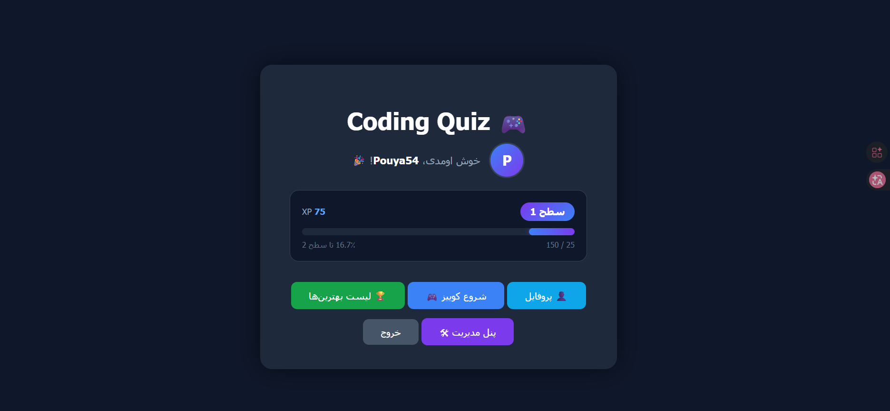
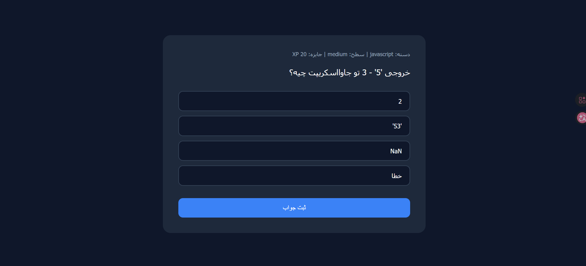
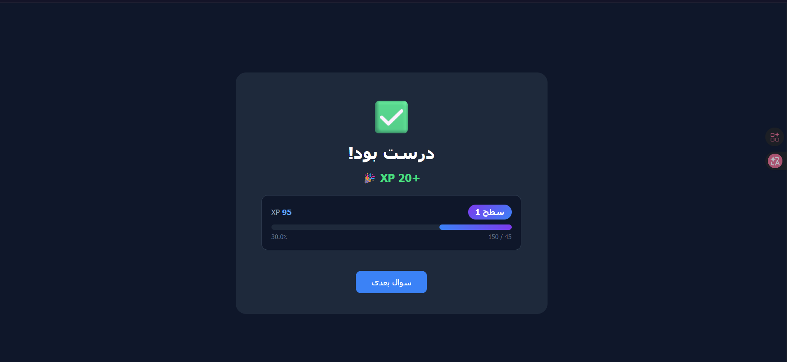
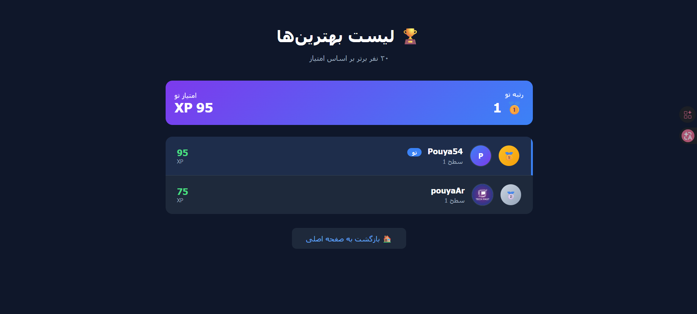
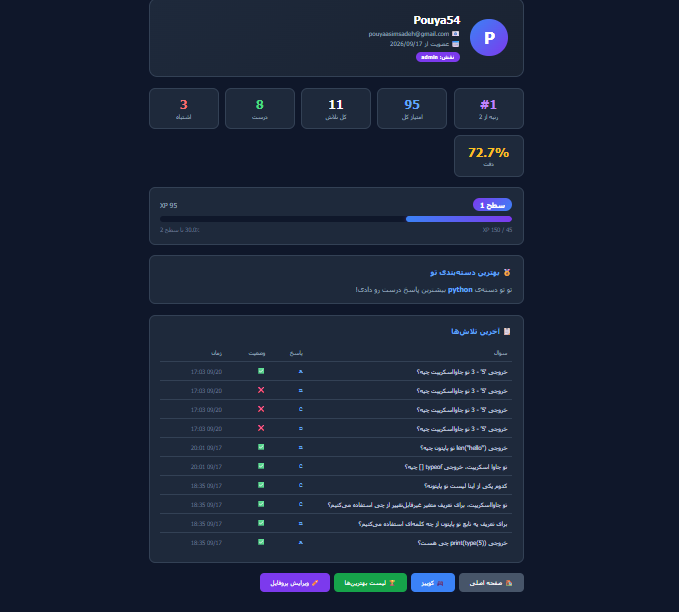
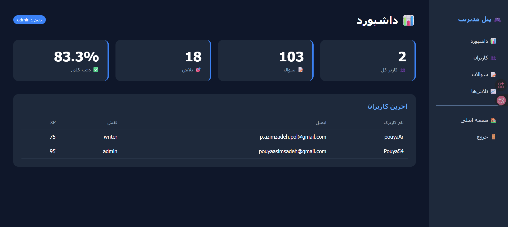
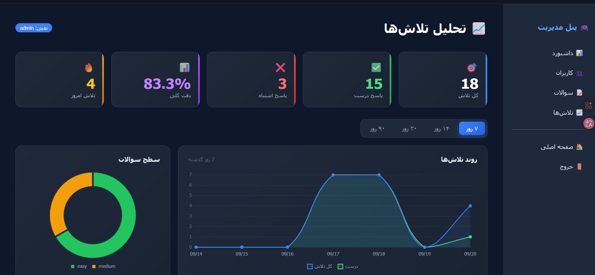

# 🎮 Coding Quiz

**یه پلتفرم بازی-آموزش برنامه‌نویسی با گیمیفیکیشن، رقابت و پنل مدیریت**

---

## 📖 درباره پروژه

یادگیری برنامه‌نویسی حوصله‌سربره. خیلی‌ها دوره‌های آموزشی رو تموم می‌کنن ولی چون تمرین کافی ندارن، خیلی زود مطالب رو فراموش می‌کنن.

**Coding Quiz** این مشکل رو با گیمیفیکیشن حل می‌کنه:

- 🎯 کاربرا به سوالات برنامه‌نویسی جواب میدن
- ⚡ با هر پاسخ درست، XP می‌گیرن و Level آپ میکنن
- 🏆 تو Leaderboard با بقیه رقابت می‌کنن
- 👤 پروفایل شخصی و عمومی دارن
- 🛠 مدیران میتونن سوالات و کاربرا رو مدیریت کنن

---

## 🖼 اسکرین‌شات‌ها

### صفحه اصلی

### کوییز

### نتیجه کوییز

### لیست بهترین‌ها

### پروفایل کاربر

### داشبورد ادمین

### تحلیل تلاش‌ها

---

## ✨ امکانات

### 👤 کاربر عادی
- ثبت‌نام، ورود، خروج (با session امن)
- کوییز با سوالات تصادفی از بین ۱۰۰+ سوال
- سیستم XP و Level با فرمول پیشرفته (`50 × level²`)
- Progress bar برای پیشرفت به لول بعدی
- Leaderboard با ۲۰ نفر برتر
- پروفایل شخصی با آواتار
- ویرایش پروفایل (ایمیل، رمز، عکس)
- مشاهده پروفایل عمومی بقیه کاربرا

### ✍️ Writer
- همه امکانات کاربر عادی
- ورود به پنل مدیریت
- افزودن سوال جدید
- ویرایش سوالات موجود

### 🛠 Admin
- همه امکانات Writer
- داشبورد آماری (تعداد کاربر، سوال، تلاش، دقت)
- مدیریت کاربران (تغییر نقش، حذف، جستجو)
- مشاهده پروفایل کامل هر کاربر
- لاگ تلاش‌ها با نمودارهای تعاملی
- فیلتر دوره زمانی (۷، ۱۴، ۳۰، ۹۰ روز)
- حذف سوالات

---

## 🏗 معماری پروژه
